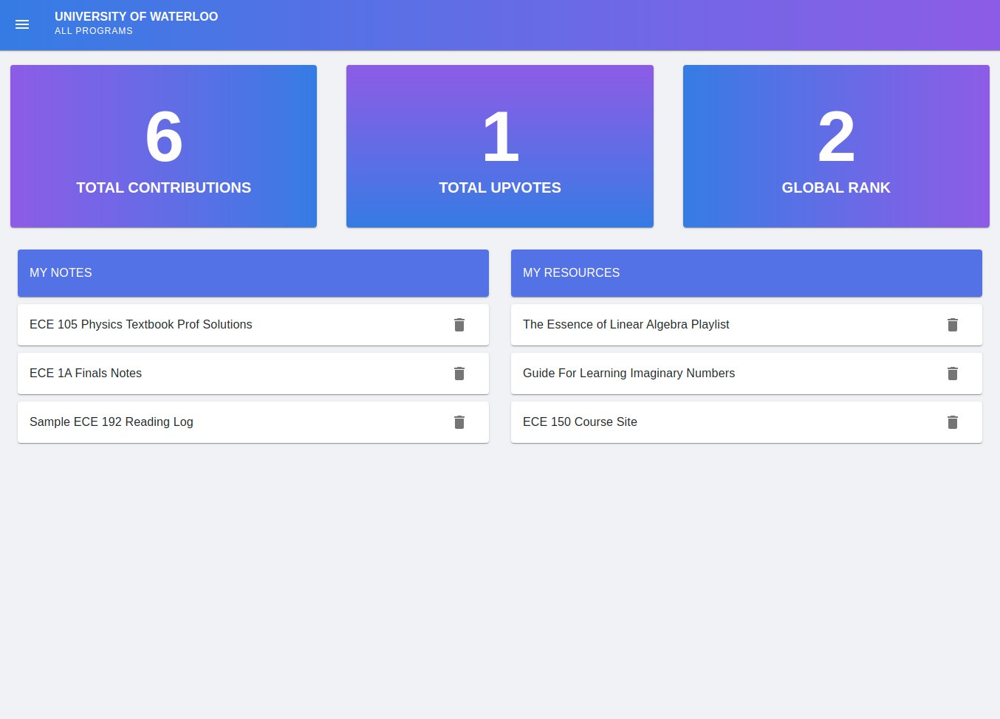

# UNote
Full stack note sharing app for universities. Created using React, Material-UI, Redux, Django, and Django Rest Framework.
The app lets users submit notes and resources for their university and program, or view shared notes from other users. Features include functional login, rating system for notes, leaderboard, and account dashboard.

## Run The Web App Locally
Instructions using virtualenv:

1. Create, activate, and cd into virtual environment
2. Clone and cd into this git repo
3. Download required python packages: ``` sudo pip3 install -r requirements.txt ```
4. Download required javascript packages: ``` npm install ```
5. Runsever: ``` python3 manage.py runsever ```

**Functionality Note**: To ensure the website is fully functional, you will also need to login to the admin site as a superuser, and add model instances for universities, programs, and resource types.

**Project Structure Notes**: 
- Frontend code exists under apps.frontend
- Backend code exists under the other apps folders (each folder holds a Django app)

## App Images



